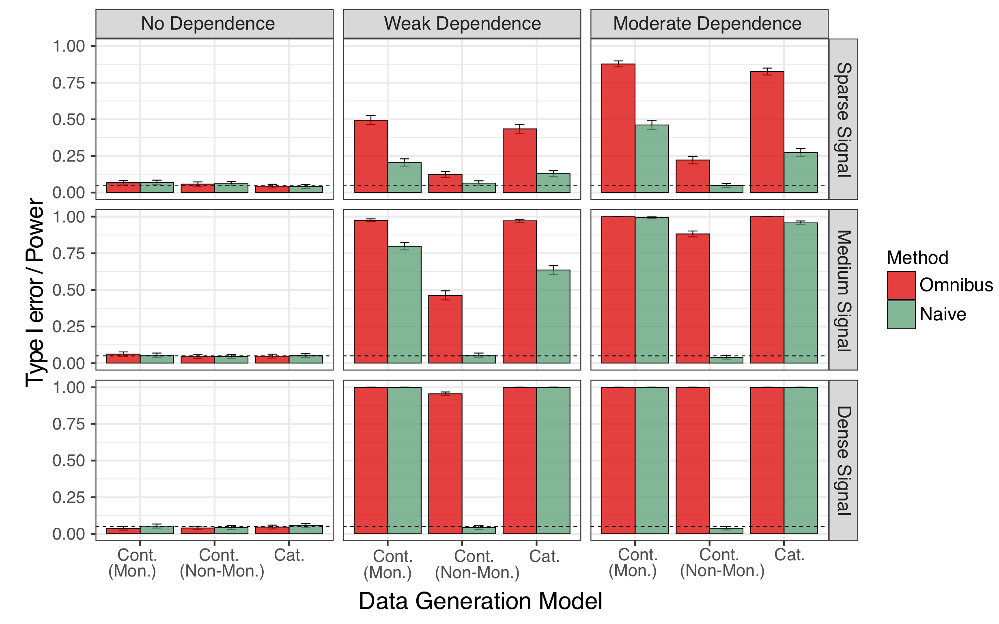

```{r setup, include=FALSE}
knitr::opts_chunk$set(echo = TRUE, fig.align = "center")
setwd("/Users/apple/Documents/GitHub/EWAS/")
```

## Contents
***
- [1. Performance on simulated data where differential CpGs were randomly distributed](#randomly)
- [2. Performance on simulated data where differential CpGs were clustered](#clustered)
<br>
<br>
<br>

### 1. Performance on simulated data where differential CpGs were randomly distributed {#randomly}
***

<br>

### 2. Performance on simulated data where differential CpGs were clustered {#clustered}
***
